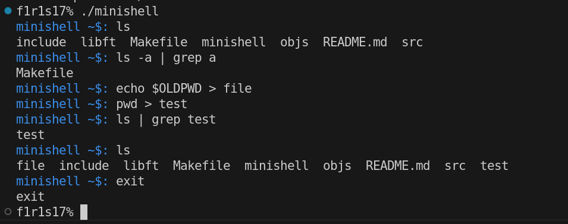

# Minishell

Minishell is a simple shell implementation inspired by the functionalities of the bash shell. This project is part of the 42 Network curriculum and aims to enhance understanding of process management, command execution, and signal handling in a Unix-like environment.



## Features

- **Command Execution**: Execute simple commands and built-in commands.
- **Piping**: Support for piping between commands using `|`.
- **Redirection**: Handle input and output redirection using `>` and `<`.
- **Environment Variables**: Access and manage environment variables.
- **Built-in Commands**: Implement built-in commands such as `cd`, `exit`, and `env`.
- **Signal Handling**: Proper handling of signals like `Ctrl+C` and `Ctrl+D`.

## Installation

To compile and run Minishell, follow these steps:

1. **Clone the repository**:
   ```bash
   git clone https://github.com/yourusername/minishell.git
   cd minishell
2. **Compile minishell**
    ```bash
    make
2. **Execute minishell**:
    ```bash
    ./minishell